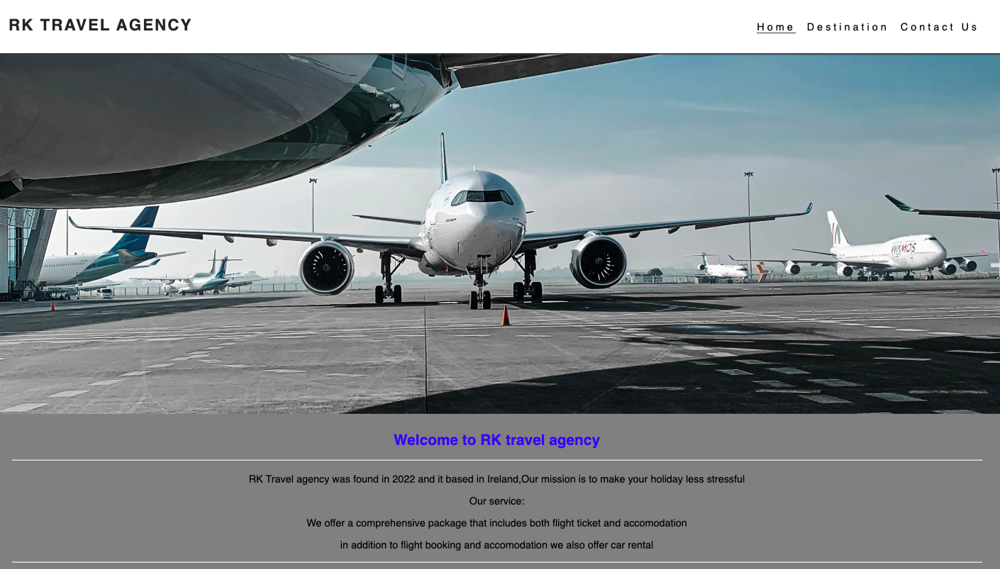
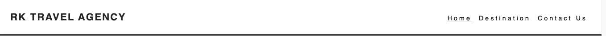
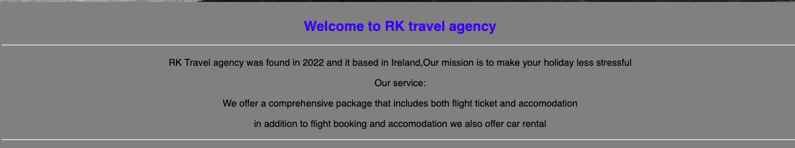
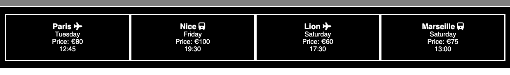
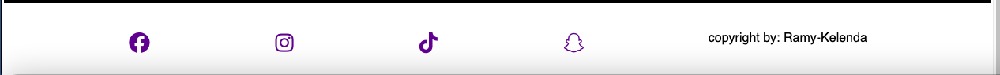
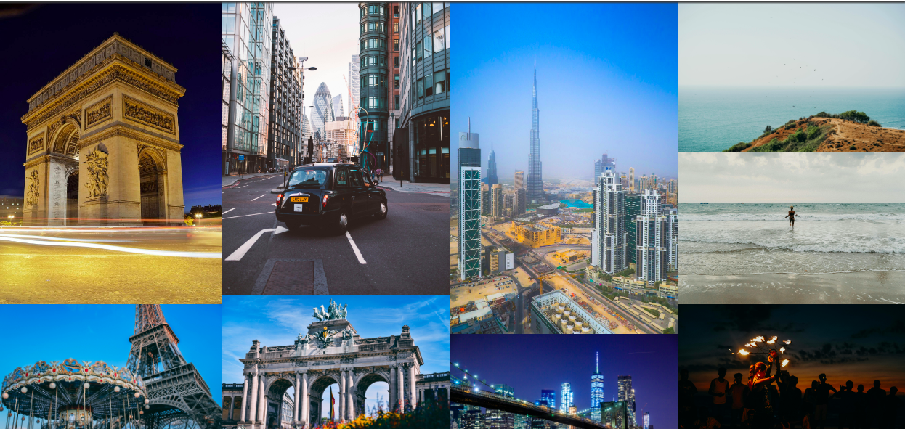
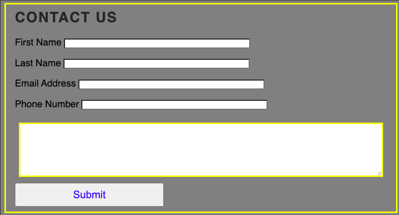

# RK TRAVEL AGENCY
This is a travel agency website. users can book holiday by filling the contact form, once the contact form is filled, the agency will contact you.

# Features
- user friendly
- Responsive website. 
The website was build for large and small devices such as laptop,tablet,mobile phone.

Existing Features

- Navigation Bar 
  - Featured on three pages : |Home| Destination | Contact us|
  - The pages is identical, It will make more easy for the users to navigate to the website.

  - In this section the users can navigate the 3 pages, and they also able to go back to the previous page.

  - The reason section

    - This is section give users the benefits of travelling with RK travel agency. in this section user will be able to read about the agency.

# Flights infos section
- This section the user will be able to see flight informations.

- The Footer
    - The footer we added social media links to the footer. the links will open new atb when the user click to the social media links.
    - Users can contact us also from our social medias pages.

# Destinations

Here are some beautiful images, city users can book holiday.

# contact us

- In this page users can fill the contact form to book an appointment with the agency.

# Testing

# Validator

# unfixed Bugs

# Deployment

# Credit 
I used code from codeinstitute [Love Running](https://code-institute-org.github.io/love-running-2.0/index.html)

# content

- [Home,Destination] page was token from codeinsitute(https://code-institute-org.github.io/love-running-2.0/index.html)

- [form textarea] the content was token from[https://www.w3schools.com/tags/tryit.asp?filename=tryhtml_textarea]

- the icons from my website were taken from [https://fontawesome.com/]

- images from my website were taken from # Images
[https://www.pexels.com/search/airplane/]