# RK TRAVEL AGENCY
RK Travel agency, We offer booking flight through online form. We have user-friendly form. To book your flight with us simply fill out the resquest form available on our website.

RK Travel agency, our goal is to make your travel experience as smooth and stress free as possible.

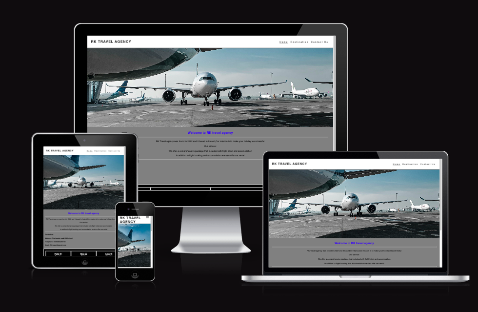

[Click Here to view RK TRAVEL AGENCY](https://ramyapepone.github.io/RK-travel-agency/)
---
## Table of contents
### [User Experience (UX)](#user-experience-ux)
* [User Stories](#user-stories)

### [Features](#features)
* [Existing Features](#Existing-Features)
### [Design](#design)
### [Technologies Used](#technologies-used)
### [Frameworks, Libraries and language used](#frameworkslibraries-and-language-used)
### [Testing](#testing-1)
* [Validation Results](#validation-results)
* [Manual Testing](#manuel-testing)
* [Lighthouse](#lighthouse-report)
### [Deployment and local development](#deployment-and-local-development)
* [GitHub Pages](#github-pages)
* [Forking the Github Respository](#forking-the-github-respository)
* [Local clone](#local-clone)
### [Credits](#credits)
### [Acknowledgement](#acknowledgement)
## User Experience (UX)
RK Travel agency undenstand the importance of user experience in the travel industry. 

RK Travel agency strive to provide a user-friendly website that prioritizes usability.

Users can book flight by fill out the form. and also can the flight on the phone.

### User Stories
* What to expect for first time visit
   * users will be able to understand the objective of the website. 
   * very easy to navigate to the website
   * Contact form provided.
* what expeting after
   * Business information
   * the agency contact information
## Feature 
* RK travel agency website is targeting families,couples who likes affordable vacations.
* users can use the contact form for booking.
* Responsive website

### Existing Features
  * Navigation Bar 
  * Content three pages
  * The navigation Bar is inclunded the page logo, Home page, Destination page, Contact us page.
  * users can easily click to the page links and also will be able go back to the main page.

  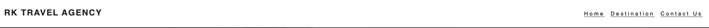

  * Main Heading
      * This content nice background image that show the airport and some airplane. 
      * Destination page is madeup with nice holiday destination. 
      * Contact us, content contact form.

  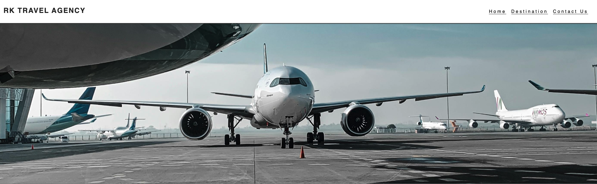

  * About RK Travel Agency
      * This is section content about us.
      * in this section users can see the contact number. 

  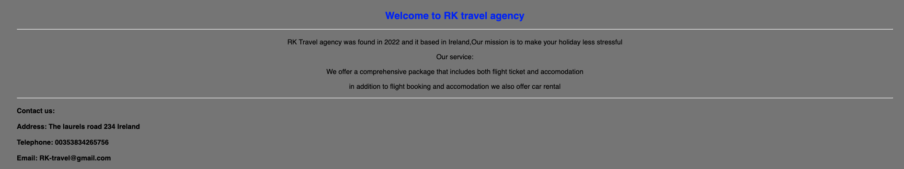

  * This is content flights destination
     * Users can see flight destination time and date, and the ticket price. 
     
  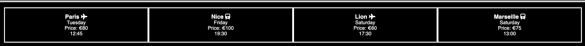

  * Footer 
     * This is content social media pages.
     * users can contact also from our social media platform. 
     * also content copyright 

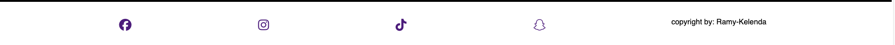

* Destination 
    * This section content users can see beautiful images for holiday. 
    * This section give the users some ideas for there next trip.

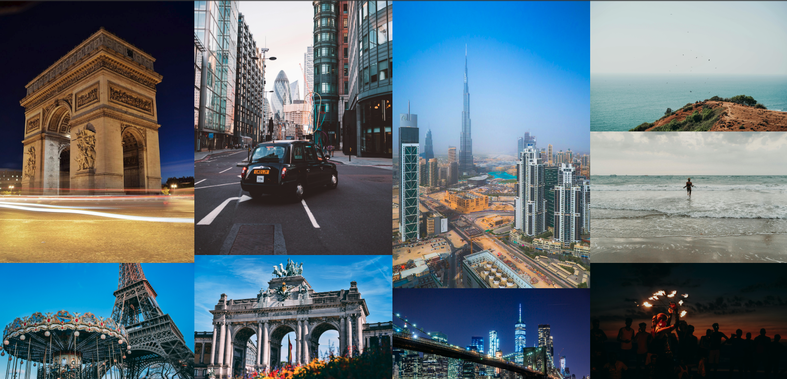

* Contact us
    * The page content the contact form
    * Users can fill out contact form to book fligh ticket.

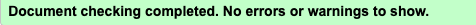

* Thank you page
    * Form sent

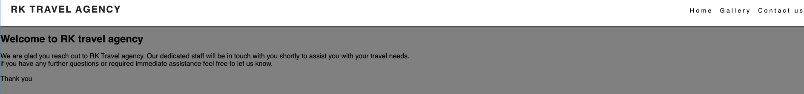

# Design

* Color scheme
   * used white color, gray color, black.
* Wireframes
  * I used pen and paper to design my website.

# Technologies Used
   * [HTML5](https://en.wikipedia.org/wiki/HTML)
   * [CSS](https://en.wikipedia.org/wiki/CSS)

## Frameworks, Libraries and language used

* [Gitpod](https://www.gitpod.io/)
      
    * I used gitpot to write my code

* [Git](https://git-scm.com/)
    * this is for code version
* [Girhub](https://github.com/)
    * This for Deployment of my website.
* [Font Awesome](https://fontawesome.com/)
    * This where I got my website font.
* [Am I responsive](https://ui.dev/amiresponsive)
    * Where i got my mockup picture.

## Testing 

I used W3C Markup Validator and W3C CSS validator

* [W3C Markup Validator](https://validator.w3.org/)
* [W3C CSS Validator](https://jigsaw.w3.org/css-validator/)

# Validation Results

index.html

Destination.html

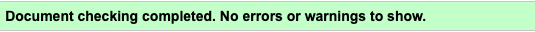

Contact Us.html

style.css

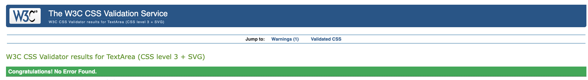

### Manual Testing
* Test the website with different browser google chrome, Microsoft Edget and more.
* The Website was view by different device such laptop,tablet,mobile phone and more.
* I used the Dev tools for testing my screen size.

### Lighthouse

### Mobile analysis

Home Page

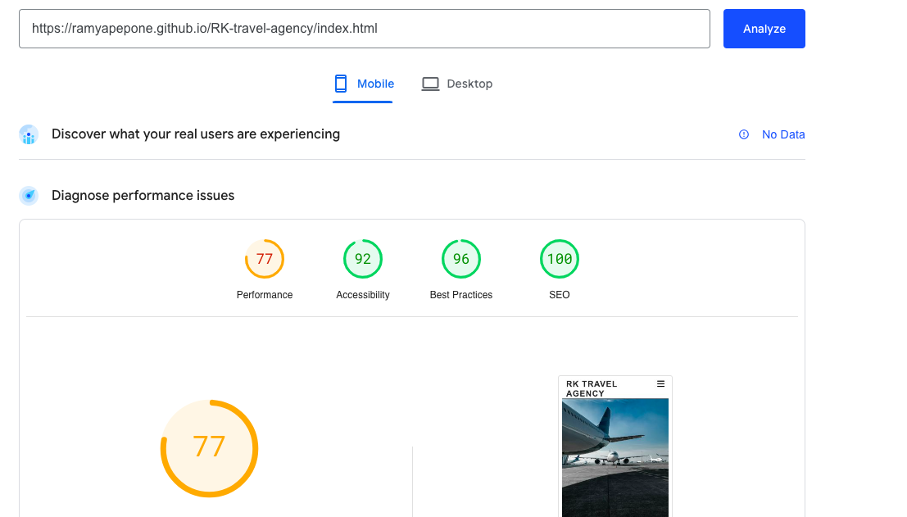

### Deployment and local development

By forking the repository, we make a copy of the original repository on our GitHub account to view and change without affecting the original repository by using these steps:

1. Log in to GitHub and locate [GitHub Repository RK Travel agency](https://ramyapepone.github.io/RK-travel-agency/)

2. At the top of the Repository(under the main navigation) locate "Fork" button.

3. Now you should have a copy of the original repository in your GitHub account.

### Local clone

1. Log in to GitHub and locate [GitHubRepository RK Travel agency](https://github.com/RamyApepone/RK-travel-agency.git)

2. Under the repository name click "Clone or download"

3. Click on the code button, select clone with HTTPS, SSH or GitHub CLI and copy the link shown.

4. Open Git Bash

5. Change the current working directory to the location where you want the cloned directory to be made.

6. Type `git clone` and then paste The URL copied in the step 3.
7. Press Enter and your local clone will be created.
